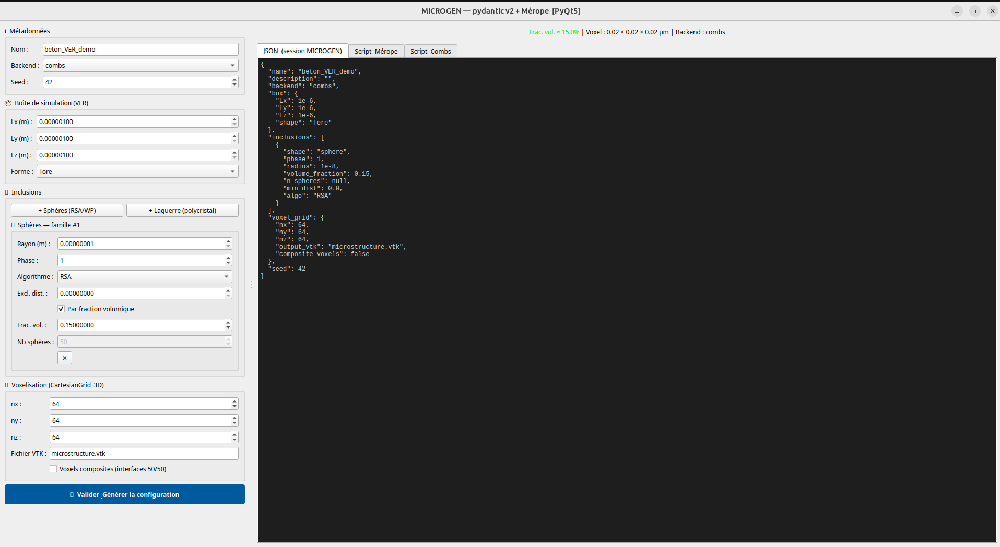
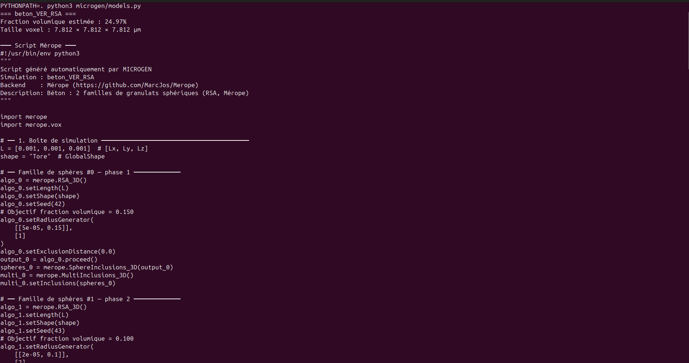
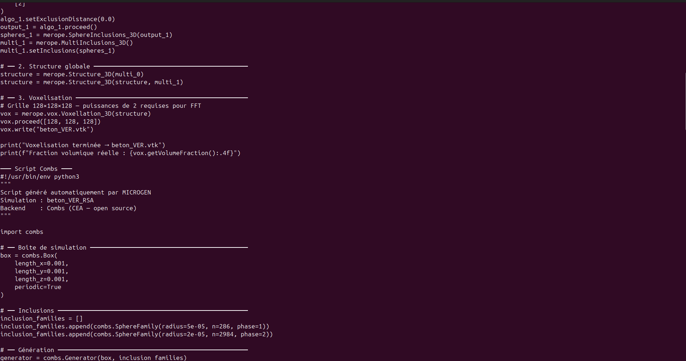
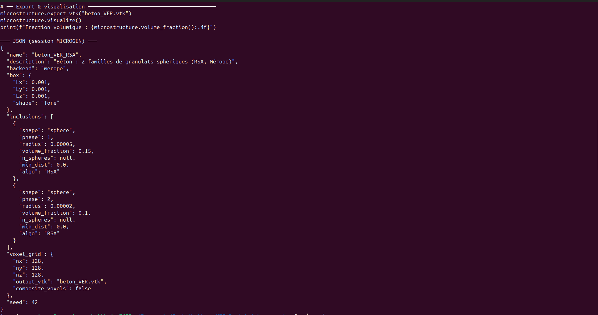

# microgen-demo

**Contribution open source — Interface pyQt/pydantic pour la génération de microstructures**  
Basé sur les API de [Mérope](https://github.com/MarcJos/Merope) et [Combs](https://www.sna-mc2013.org/).

---

## Aperçu de l’interface graphique



*Fenêtre principale de configuration des microstructures (PyQt5).*

---

## Démonstration en ligne de commande

Exemple de génération de scripts et de JSON avec `make demo` :





*Les captures montrent la sortie complète : scripts Mérope, scripts Combs et la session JSON.*

---

## Ce que cette contribution apporte

- **Modèle de données pydantic v2** → validation, sérialisation JSON, round-trip.
- **Interface graphique PyQt5 / PySide6** → configuration visuelle des microstructures.
- **Génération de scripts** pour Mérope et Combs (API réelle).
- **Tests unitaires** (pytest) et couverture de code.

---

## Installation rapide

```bash
git clone https://github.com/CodingYayaToure/Merope
cd Merope
make install          # pydantic + pytest
make install-qt5      # ou : make install-qt6
```

---

## Utilisation

```bash
make demo             # CLI — affiche JSON + scripts générés
make gui              # Interface graphique PyQt5/PySide6
make test             # 30+ tests unitaires (pytest)
make coverage         # Rapport HTML de couverture
make example          # Génère scripts/merope_beton.py + combs_beton.py
make example-laguerre # Génère script polycristal Laguerre
```

---

## Architecture du modèle

```
MicrostructureConfig          ← racine, source de vérité unique
├── name, description, backend, seed
├── SimulationBox             ← Lx, Ly, Lz, shape (GlobalShape.Tore)
│   └── as_merope_L()         → [Lx, Ly, Lz]  pour algo.setLength(L)
├── inclusions : list[AnyInclusion]   ← union discriminée par "shape"
│   ├── SphereFamily          ← sac_de_billes RSA/WP/AlgoBool
│   │   ├── volume_fraction   → algo.setRadiusGenerator([[R, phi]], [phase])
│   │   └── n_spheres         → algo.fillMaxRSA_3D(n)
│   ├── MultiSphereFamily     ← distribution multi-rayons
│   │   └── to_merope_args()  → (desiredRPhi, tabPhases)
│   ├── LaguerreTessFamily    ← polycristal via voro++
│   │   └── LaguerreTess_3D(L, n_grains)
│   └── EllipsoidFamily       ← PolyInclusions_3D
├── VoxelGrid                 ← CartesianGrid_3D
│   ├── nx, ny, nz            → puissances de 2 (FFT tmfft/AMITEX)
│   └── as_merope_list()      → [nx, ny, nz]
├── volume_fraction_estimate() → validation temps réel dans GUI
├── voxel_size_um()           → diagnostic physique
├── to_merope_script()        → script Python Mérope complet
├── to_combs_script()         → script Python Combs complet
├── to_json() / from_json()   → session .microgen (sauvegarde)
```

---

## Utilisation de l’API réelle de Mérope

Les scripts générés appellent l’API Python **documentée** de [Mérope](https://github.com/MarcJos/Merope).  
Extrait typique produit par `to_merope_script()` :

```python
import merope
import merope.vox

L = [0.001, 0.001, 0.001]            # SimulationBox.as_merope_L()
shape = "Tore"                        # GlobalShape.TORE

algo = merope.RSA_3D()
algo.setLength(L)
algo.setShape(shape)
algo.setSeed(42)                      # MicrostructureConfig.seed
algo.setRadiusGenerator([[5e-05, 0.15]], [1])   # SphereFamily (vf)
output = algo.proceed()

spheres = merope.SphereInclusions_3D(output)
multi = merope.MultiInclusions_3D()
multi.setInclusions(spheres)

structure = merope.Structure_3D(multi)
vox = merope.vox.Voxellation_3D(structure)
vox.proceed([128, 128, 128])          # VoxelGrid.as_merope_list()
vox.write("microstructure.vtk")
```

> **Note** : Ce projet ne nécessite pas l’exécution réelle de Mérope. Les scripts générés sont syntaxiquement conformes à l’API publique. Leur exécution effective suppose une installation fonctionnelle de Mérope (non incluse).

---

## Fonctionnalités pydantic v2 exploitées

- **`Field(gt=0, discriminator=...)`** — validation déclarative
- **`field_validator`** — validation single-field
- **`model_validator(mode="after")`** — validation croisée
- **`Annotated[Union[...], Field(discriminator="shape")]`** — union discriminée pour les inclusions polymorphiques
- **`model_dump_json()` / `model_validate_json()`** — round-trip JSON parfait

---

## Abstraction PyQt5 / PySide6

Compatibilité assurée en **2 lignes** :

```python
try:
    from PyQt5.QtWidgets import QApplication, ...
    from PyQt5.QtCore import pyqtSignal as Signal
    QT_BACKEND = "PyQt5"
except ImportError:
    from PySide6.QtWidgets import QApplication, ...
    from PySide6.QtCore import Signal
    QT_BACKEND = "PySide6"
```

---

## Tests

```
tests/test_models.py  — 30+ tests organisés par classe
  TestSimulationBox         → volume, as_merope_L, rejets invalides
  TestSphereFamily          → modes vf/n, exclusion mutuelle, volumes
  TestMultiSphereFamily     → to_merope_args, vf totale < 1
  TestVoxelGrid             → puissance de 2, warning
  TestMicrostructureConfig  → vf, voxel size, JSON roundtrip,
                              scripts Mérope (setLength, setRadiusGenerator,
                              MultiInclusions_3D, Voxellation_3D, setSeed...)
  TestPerformance           → 1000 sérialisations < 1s
```

---

## Limitations

- L’exécution réelle des scripts générés nécessite une installation fonctionnelle de **Mérope** (non incluse dans ce dépôt).  
- L’intégration complète dans **SALOME** n’est pas réalisée.  
- L’API Combs n’a pas été testée faute d’accès à la bibliothèque, mais la génération de scripts suit la documentation.

---

## Références

- [Mérope (MarcJos/Merope)](https://github.com/MarcJos/Merope)  
  M. Josien, *Mérope: A Microstructure Generator for Simulation of Heterogeneous Materials*, 2024, hal04486524
- [Combs](https://www.sna-mc2013.org/) — C. Bourcier et al., SNA+MC 2013
- [SALOME platform](https://www.salome-platform.org)
- [pydantic v2 docs](https://docs.pydantic.dev/latest/)
```


